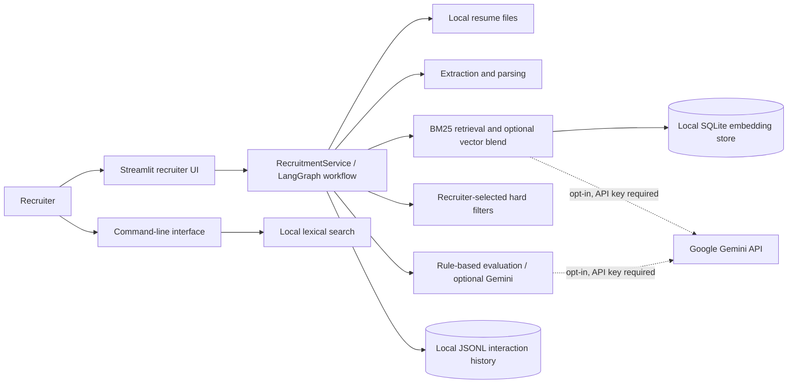
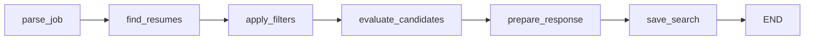

# HireFlow Design Document

## 1. Purpose and Scope

HireFlow is a local-first recruiter tool for storing resumes, searching them against a job description, applying explicit filters, and reviewing ranked candidate evidence. The primary interface is a Streamlit application. A command-line interface supports listing and lexical searching of the local resume library.

This document describes the current implementation, rather than an aspirational target architecture. Gemini-based semantic search and evaluation are optional; local BM25 search and rule-based evaluation are the default. HireFlow supports PDF, TXT, Markdown, and Markdown-with-`.markdown`-extension resumes. It does not perform OCR or make hiring decisions.

## 2. High-Level Design (HLD)

### 2.1 System Context



The Streamlit UI invokes `RecruitmentService`, which coordinates the end-to-end recruiter search. Local resume files are the system of record. Candidate records and job descriptions are constructed at runtime; they are not stored in a separate candidate database. The vector table is a cache-like store for optional resume embeddings, and interaction history is an append-only local JSONL file.

### 2.2 Main Runtime Flow

1. The recruiter adds resume files through the UI, or places supported files under `data/resumes/`.
2. The recruiter enters a job description. The app extracts likely title, known skills, experience, and location for display and filter defaults.
3. On search, `RecruitmentService` runs a linear LangGraph workflow: parse job, find resumes, apply selected filters, evaluate and rank candidates, prepare the response, and save the search interaction.
4. Changed/new resume files are parsed and cached by content fingerprint; unchanged files reuse their cached fields and chunks. BM25 scores chunks. If Gemini is enabled and configured, chunk embeddings are requested and combined with lexical scores when available.
5. The recruiter reviews candidate summaries, scores, gaps, risks, and source-resume evidence. A review action is recorded locally.

### 2.3 Component Responsibilities

| Component | Responsibility |
| --- | --- |
| `streamlit/app.py` | Resume upload, job-description entry, filter controls, Gemini opt-in, search invocation, result and error display, review logging. |
| `main.py` | `list` and `search` command-line actions; uses local resume discovery and search. |
| `core/recruitment.py` | LangGraph workflow and orchestration of parsing, retrieval, filtering, evaluation, response construction, and search logging. |
| `core/ingestion.py` | Supported-file discovery, safe local upload storage, per-file extraction and candidate construction. |
| `core/local_index.py` | SQLite cache of parsed resumes and chunks, keyed by resolved source path and content fingerprint. |
| `core/parsing.py` | PDF/text extraction, text normalization, common-field and known-skill extraction, job-description parsing, and chunk splitting. |
| `core/hybrid_indexer.py` | BM25 scoring, optional Gemini embedding retrieval, score blending, and retrieval ordering. |
| `core/filters.py` | Required-skill, location, and minimum-experience hard filters. |
| `core/re_ranker.py` | Rule-based or Gemini candidate evaluation and final ranking. |
| `core/gemini_client.py` | Optional Gemini embeddings and structured evaluation; failures are returned as unavailable results for local fallback. |
| `core/vector_store.py` | SQLite persistence for chunk vectors and metadata, with stale-vector cleanup. |
| `core/memory_rag.py` | Privacy-minimized JSONL search/review records, retention pruning, and optional token-overlap retrieval. |
| `core/models.py` | Pydantic data contracts for candidates, jobs, and evaluations. |
| `core/evaluator.py` | Dependency-free ranking and RAG-style evaluation metrics. |
| `config.py` | Environment configuration, data paths, and directory initialization. |

### 2.4 External Dependencies and Trust Boundaries

- **Local boundary:** Resumes, parsed-resume cache, SQLite chunk vectors, and interaction records are written beneath the configured data directory (default `data/`). Local BM25 and rule-based evaluation do not require a network or credential.
- **Gemini boundary:** Gemini is disabled by default in the UI and requires both recruiter opt-in and `GEMINI_API_KEY`. When enabled, the full parsed job text and individual resume chunks may be sent to Google for embeddings. Evaluation inputs are truncated to 6,000 characters for the job and 12,000 characters for a resume.
- **No other service boundary:** The application does not require a remote database, hosted vector index, or authentication service for local use.

## 3. Low-Level Design (LLD)

### 3.1 Workflow State and Transitions

`RecruitmentService` compiles a `StateGraph` over the `RecruitmentState` TypedDict. The workflow is sequential and has no conditional branches:



| Step | Input | Operation | Output |
| --- | --- | --- | --- |
| `parse_job` | `job_text` | Calls `parse_job_description`. | `job: JobDescription` |
| `find_resumes` | Parsed job, resume directory, Gemini option, refresh flag | Calls `search_resumes` with a large retrieval cap so recruiter filters can be applied after retrieval; reuses unchanged files and collects per-file errors. | `retrieved`, `ingestion_errors` |
| `apply_filters` | Retrieved candidate records and selected filter values | Calls `filter_candidates`; retains retrieved result metadata for accepted candidate IDs. | `selected` |
| `evaluate_candidates` | Selected results and job | With Gemini enabled, evaluates at most the requested shortlist size to limit API usage; otherwise evaluates the selected results locally. Truncates to the requested result limit. | `ranked` |
| `prepare_response` | Retrieval, selected and ranked results | Sets state to `matches`, `no_resumes`, `no_retrieval_matches`, or `filters_removed_all`; returns broader candidates when filters remove all selected results. | Recruiter-facing `response` |
| `save_search` | Parsed job | Appends a search record to local interaction history. | No additional state |

The UI calls `search(job_text, limit, required_skills, location, minimum_experience, use_gemini, refresh_index)` and reads the returned response dictionary. The CLI calls `search_resumes` directly and does not run the full filter/evaluation workflow.

### 3.2 Data Contracts

The Pydantic models in `core/models.py` define the principal runtime records:

| Model | Fields |
| --- | --- |
| `Candidate` | `candidate_id`, `name`, optional `email`, `phone`, `location`, full `text`, `skills`, optional `experience_years` |
| `JobDescription` | `jd_id`, `title`, normalized `text`, `required_skills`, `optional_skills`, optional `min_experience`, optional `location` |
| `CandidateEvaluation` | `candidate_id`, `fit_score` constrained to 0–10, `strengths`, `gaps`, `risks`, `summary`, exact-source `evidence` strings, `evaluator` |

Each ingested resume is represented as a dictionary containing its file name and path, full extracted text, `Candidate`, and generated `chunks`. Retrieval result dictionaries represent the best matching chunk for a resume and add BM25/vector scores, retrieval mode, and a short passage; evaluation adds an evaluation model and final score.

### 3.3 Resume Ingestion and Parsing

1. `list_resume_files` scans only the top level of the resume directory, filters by supported suffix, and returns a stable case-insensitive filename order.
2. `save_resume` sanitizes uploaded names to a basename and adds a numeric suffix rather than overwriting an existing file.
3. `extract_text` uses `pypdf` for PDFs and UTF-8 text decoding with replacement for TXT/Markdown. Text is normalized while preserving paragraph boundaries.
4. `parse_candidate_text` selects the first non-empty line as a likely name unless it resembles contact data; regular expressions extract email, phone, stated years of experience, and `Location:`/`Based in:` values. Skills include known terms and arbitrary values in explicitly labeled skill, technology, tool, framework, or platform lists.
5. `parse_job_description` uses similar rules. Terms in sentences containing `nice to have`, `preferred`, `bonus`, or `optional` are classified as optional; other recognized or explicitly listed terms are required.
6. `split_into_chunks` creates configured overlapping text chunks. BM25 and optional embeddings score these chunks; the highest-scoring chunk represents each resume and is returned as its matching passage.
7. An exception on one resume is collected as an ingestion error and does not prevent processing subsequent files.

The extraction remains heuristic and text-based. Common contact fields and experience rely on regular expressions, and unlabelled uncommon skills may not be extracted as candidate fields. Scanned/image-only PDFs may yield no useful text; OCR is not included. This is not a general-purpose resume parser.

### 3.4 Incremental Local Index

`LocalResumeIndex` stores parsed documents in `data/hybrid_index/resume_cache.sqlite3`, keyed by resolved file path and a SHA-256 fingerprint of source-file bytes plus parser/cache version. Unchanged files reuse parsed text, candidate fields, chunks, and tokenized chunks. New or modified files are reparsed and replace their cache row; missing files are pruned. Bump the cache version when parsing/tokenization behavior changes. The Streamlit refresh checkbox and CLI `--refresh-index` option force a re-parse. The cache is intended for a single local user, not concurrent or multi-tenant indexing.

### 3.5 Retrieval and Ranking

**BM25 path:** The tokenizer lowercases text and extracts alphanumeric tokens. `_bm25_scores` calculates a BM25-like lexical score over the current resume chunks, normalizes by the highest score in the set, and returns scores in the 0–1 range. Resumes without a positive final retrieval score are omitted.

**Optional semantic path:** With `use_gemini=True`, HireFlow embeds the full job text and each resume chunk using the configured Gemini embedding model. Chunk vectors are stored in SQLite under a source-path-derived key plus chunk number, with source/chunk fingerprints. Stale chunks and legacy resume-level vectors are removed. Cosine similarity is clamped to a minimum of zero. When both query and chunk vectors are available, the retrieval score is:

$$S_{retrieval} = w_{BM25} S_{BM25} + w_{vector} S_{vector}$$

The default weights are 0.6 and 0.4 and are normalized to sum to one. Negative weights and an all-zero total are rejected. If the API is unavailable or an embedding cannot be produced, lexical BM25 remains available. `retrieval_mode` is reported as `hybrid` only when the result uses both lexical and vector scores; otherwise it is `BM25`.

**Evaluation and final ordering:** Rule-based evaluation compares extracted known skills and any stated job experience/location with candidate fields. It reports missing information as a gap or risk rather than assuming a value. Gemini evaluation, when requested, uses structured output and is accepted only if the candidate ID matches and every evidence quote occurs in the resume text; otherwise rule-based evaluation is used.

The combined ranking score is:

$$S_{final} = 0.4 S_{retrieval} + 0.6 \frac{S_{fit}}{10}$$

Results are sorted descending by the applicable score, with candidate name as a deterministic tie-breaker. The UI shows both retrieval and evaluation scores, plus evidence and explanatory fields.

### 3.6 Filtering and Response States

Filters are recruiter-selected constraints, not automatic exclusions based on every extracted job requirement:

- **Skills:** all selected skills must occur in the candidate's extracted skill set, case-insensitively.
- **Location:** the requested string must be a case-insensitive substring of the extracted candidate location.
- **Experience:** the extracted value must exist and be greater than or equal to the selected minimum.

The response state communicates the result of the workflow: `matches`, `no_resumes`, `no_retrieval_matches`, or `filters_removed_all`. In the last case, the response includes a smaller pre-filter shortlist to help the recruiter understand that broader matches existed.

### 3.7 Persistence and Configuration

| Data | Default location | Format / lifecycle |
| --- | --- | --- |
| Resume documents | `data/resumes/` | User-provided PDF/TXT/Markdown files; retained until manually removed. |
| Parsed resume cache | `data/hybrid_index/resume_cache.sqlite3` | SQLite cache keyed by resolved file path and versioned source-content fingerprint; stores extracted text, fields, chunks, and tokens. |
| Embedding index | `data/hybrid_index/vectors.sqlite3` | SQLite `vectors` table keyed by source hash and chunk number; vector JSON plus source/chunk metadata. |
| Interaction history | `data/memory/interactions.jsonl` | Local JSONL records with hashed query/resume identifiers, optional redacted terms, and retention pruning. |
| Settings | `.env` and environment | API key, model names, paths, result/chunk limits, retrieval weights, history retention, and optional query-term storage. |

`HIREFLOW_DATA_DIR` changes the root data directory. `ensure_data_directories` creates the resume, index, and memory directories at startup. `.env` and local data are ignored by Git. No user documents or credentials belong in source control.

Interaction entries contain a UTC timestamp, a SHA-256 query digest, and an optional digest of the reviewed resume identifier. Full job text is not stored. `HIREFLOW_STORE_QUERY_TERMS=true` opts into storing up to 128 tokenized terms after email/phone removal; names and other identifying terms may still remain in these tokens. `HIREFLOW_HISTORY_RETENTION_DAYS` controls expiry (default 30 days, minimum one). Access prunes expired entries and migrates legacy raw-query records to redacted metadata. `retrieve_related` can rank retained terms by overlap, but the recruiter workflow does not use that helper to change ranking.

### 3.8 Failure Handling

| Condition | Current behavior |
| --- | --- |
| Resume changed or removed | Content fingerprints trigger reparse; missing cache rows and stale chunk vectors are pruned. |
| No resume files | Search returns `no_resumes`. |
| Unreadable or malformed resume | Skip that file, retain an error message, continue scanning others. |
| No positive search result | Return `no_retrieval_matches` and show the UI's broader-search suggestion. |
| Selected filters exclude every retrieved candidate | Return `filters_removed_all` and include a broader result list. |
| Gemini key missing, request fails, or output is invalid | Use BM25 and/or rule-based evaluation where possible. |
| Missing candidate fields | Keep them unknown; rule-based evaluation can report a gap or risk. |
| Scanned PDF | No OCR; it may produce empty/unusable text and consequently no match. |
| Interaction write error | Not converted into a user-facing fallback by the workflow; persistence errors may fail the search operation. |

## 4. Quality Attributes and Constraints

- **Privacy by default:** Local processing requires no network. Sending candidate/job content externally requires a configured key and explicit per-search opt-in in the UI.
- **Resilience:** Failures on individual resumes do not stop the scan; optional Gemini failures fall back to local methods.
- **Modularity:** Parsing, ingestion, retrieval, filtering, evaluation, persistence, and UI responsibilities live in separate modules.
- **Determinism:** Local extraction and ranking use deterministic rules and stable tie-breaking, subject to filesystem contents.
- **Scale:** Source files are hashed during search to detect changes; unchanged files avoid PDF/text parsing while BM25 scores the in-memory chunk corpus. This is intended for a small local collection, not concurrent multi-tenant or large-scale production use.
- **Human oversight:** Scores and extracted fields are evidence aids, not a hiring decision. Recruiters should verify the original resume and account for extraction limitations.
- **Fairness and data minimization:** The Gemini evaluation prompt prohibits use of protected characteristics and asks not to infer missing facts. This is a prompt-level safeguard, not a guarantee; human review remains necessary.

## 5. Verification and Operations

The repository's checks are:

```powershell
python -m unittest discover -s tests -v
python -m compileall -q .
streamlit run streamlit/app.py
```

Tests cover parsing and chunking, local retrieval, filter/evaluation workflow behavior, evidence, malformed PDF handling, ranking metrics, and SQLite vector persistence. Local files can be inspected under `data/`; do not include real resumes, `.env` contents, or interaction history in bug reports or commits.

To assess ranking with recruiter-reviewed examples, use a JSONL file with one record per query: `{"query":"Python engineer","relevant_candidate_ids":["resume-01.txt"]}`. Run `python main.py evaluate path/to/labels.jsonl --k 10` for macro Precision@k, Recall@k, and MRR. Add `--use-gemini` to evaluate hybrid retrieval. Weight calibration requires representative relevance labels.

## 6. Known Limitations and Evolution Points

- Parsing remains heuristic: common fields rely on regular expressions, and uncommon skills outside labeled lists may be missed. A general-purpose parser needs a separately evaluated parser/model integration.
- The incremental index is a local SQLite cache keyed by file path and content fingerprint. Larger or concurrent/multi-user deployments need coordinated index lifecycle, tenant isolation, encryption, retention, and provider-consent controls.
- Query text is not stored by default and records expire, but hashes are not anonymization. Optional query tokens may contain names or other identifying text; shared deployments need stronger access, deletion, and retention controls.
- There is no OCR, authentication, multi-user isolation, access-control model, or deletion/audit workflow beyond local filesystem operations.
- BM25 and blended scores remain heuristics. The labeled evaluation command reports ranking metrics, but production weight calibration still requires a representative, recruiter-reviewed dataset.